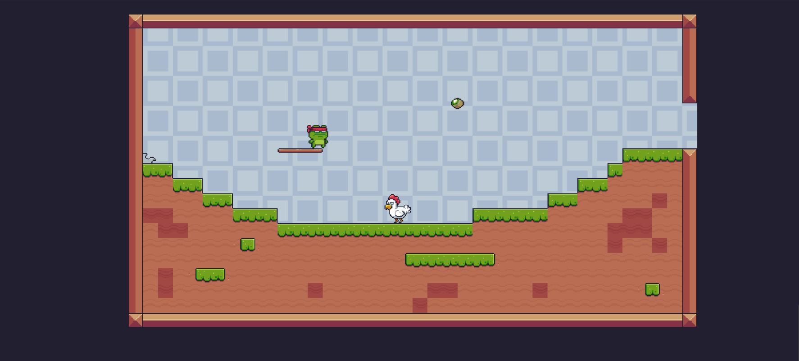
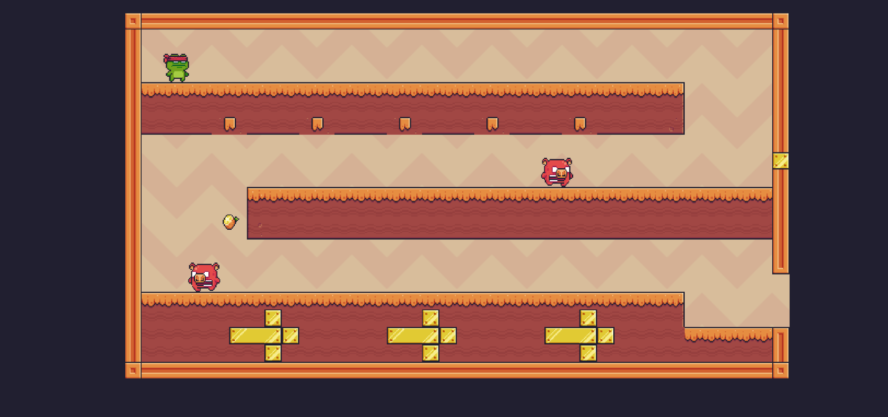
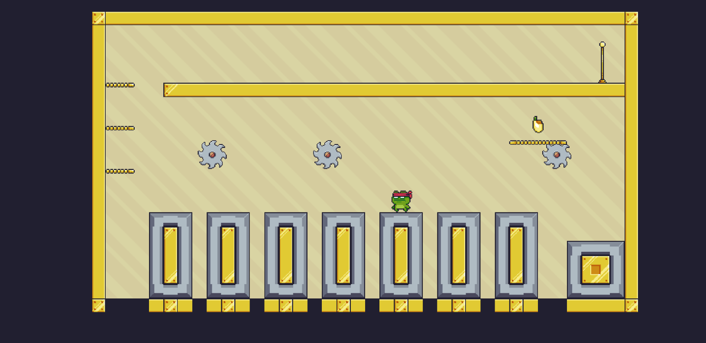
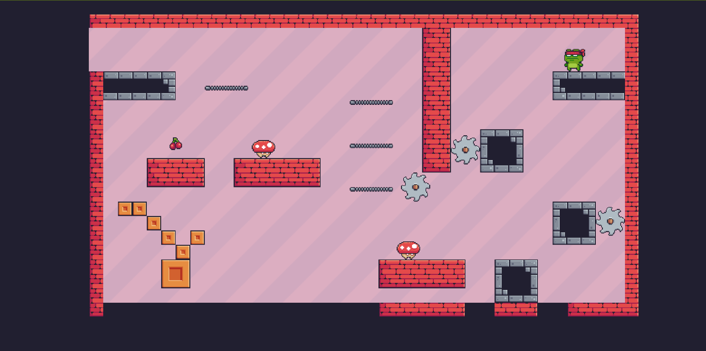

  Dự án phát triển game pixel trên nền tảng Flutter và Flame đã đạt được các mục tiêu đề ra, bao gồm việc xây dựng một trò chơi 2D có nhân vật chính với hệ thống di chuyển linh hoạt thông qua joystick và nút nhảy. Quá trình phát triển game không chỉ giúp nâng cao kỹ năng lập trình trên Flutter mà còn mang lại trải nghiệm thực tế về cách sử dụng thư viện Flame để xử lý đồ họa, va chạm, hoạt ảnh và logic game.

  Hệ thống điều khiển trong game được thiết kế đơn giản nhưng hiệu quả, giúp người chơi dễ dàng thao tác. Các đối tượng như Checkpoint hay Saw đã được lập trình để tạo ra sự tương tác với nhân vật, mang lại thử thách và làm phong phú thêm lối chơi. Ngoài ra, việc sử dụng sprite animation giúp game trở nên sống động hơn, tạo cảm giác mượt mà khi di chuyển và tương tác với môi trường.

  Hệ thống điều khiển trong game được thiết kế đơn giản nhưng hiệu quả, giúp người chơi dễ dàng thao tác. Các đối tượng như Checkpoint hay Saw đã được lập trình để tạo ra sự tương tác với nhân vật, mang lại thử thách và làm phong phú thêm lối chơi. Ngoài ra, việc sử dụng sprite animation giúp game trở nên sống động hơn, tạo cảm giác mượt mà khi di chuyển và tương tác với môi trường.

  Các tính năng như AI cho kẻ địch, hệ thống vật lý, và mở rộng bản đồ và lưu data có thể được tích hợp để làm phong phú hơn nội dung game. 
